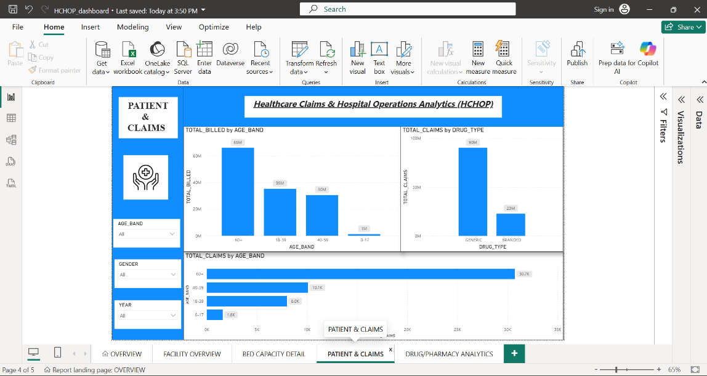
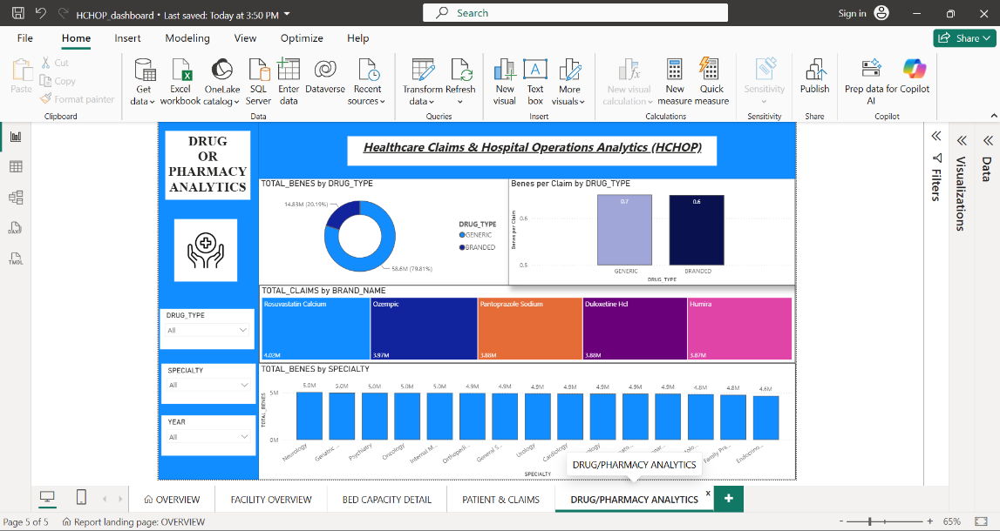
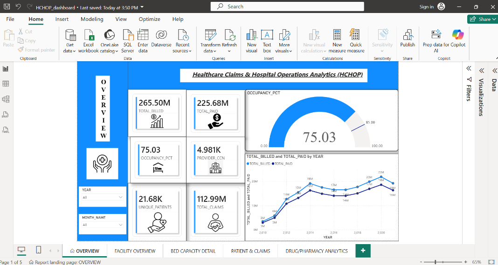
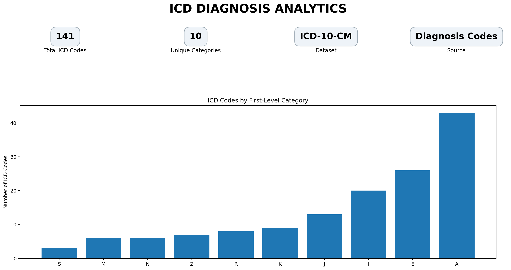

# 🏥 Healthcare Analytics Platform

## 📌 Project Overview

The **Healthcare Analytics Platform** is an end-to-end data analytics project built using **AWS S3, Snowflake, Snowpipe, SQL, and Power BI**.

The project processes healthcare data from multiple sources, including:

* 💊 Drug Prescription Data
* 🏥 Hospital Cost Data
* 👨‍⚕️ Patient FHIR JSON Data
* 🩺 ICD-10 Diagnosis Codes

The data is stored in AWS S3 and ingested into Snowflake using stages and Snowpipe. The project follows a **Medallion Architecture** approach for organizing and transforming healthcare data.

---

# 🏗️ Architecture

```text
                    Healthcare Data Sources
                           │
          ┌────────────────┼────────────────┐
          │                │                │
       CSV Files        JSON Files        TXT Files
          │                │                │
          └────────────────┼────────────────┘
                           │
                           ▼
                     ☁️ AWS S3
                           │
                           ▼
                    Snowflake Stage
                           │
                           ▼
                      Snowpipe
                    (Data Ingestion)
                           │
                           ▼
                    🥉 Bronze Layer
                      Raw Data
                           │
                           ▼
                    🥈 Silver Layer
                 Cleaned & Transformed Data
                           │
                           ▼
                    🥇 Gold Layer
                 Analytics Ready Data
                           │
                           ▼
                     📊 Power BI
                      Dashboards
```

---

# 🛠️ Technologies Used

| Technology | Purpose                        |
| ---------- | ------------------------------ |
| AWS S3     | Cloud Storage                  |
| Snowflake  | Cloud Data Warehouse           |
| Snowpipe   | Automated Data Ingestion       |
| SQL        | Data Transformation & Analysis |
| Power BI   | Data Visualization             |
| GitHub     | Project Version Control        |

---

# 📂 Project Data Sources

## 💊 Drug Prescription Data

The drug dataset contains prescription-related information such as:

* Prescriber NPI
* Prescriber Name
* City
* State
* Drug Brand Name
* Generic Drug Name
* Total Claims
* Total Drug Cost
* Total Beneficiaries

---

## 🏥 Hospital Cost Data

The hospital cost dataset contains:

* Provider Information
* Facility Name
* Location
* State
* Number of Beds
* Patient Revenue
* Net Patient Revenue
* Hospital Type
* Rural vs Urban Classification
* Fiscal Year

---

## 👨‍⚕️ Patient FHIR Data

Patient data is stored in JSON format using healthcare-related FHIR resources.

The dataset is used for:

* Patient Analytics
* Healthcare Claims
* Clinical Information
* Healthcare Service Analysis

---

## 🩺 ICD Diagnosis Data

The ICD dataset contains:

* ICD Code
* Diagnosis Description

This dataset can be used as a diagnosis reference for healthcare analytics.

---

# 🥉 Bronze Layer

The Bronze layer stores raw data ingested from AWS S3.

### Tables

* `drug_data`
* `hospital_cost`
* `patient_raw`
* `icd_codes`

The raw files are loaded using Snowflake stages and Snowpipe.

---

# 🔄 Data Ingestion

The project uses **Snowflake Snowpipe** for automated data ingestion.

### Pipes Created

* `drug_pipe`
* `patient_pipe`
* `icd_pipe`

Snowpipe continuously monitors the configured data source and loads new files into Snowflake tables.

---

# 📊 Power BI Dashboards

The project includes separate analytics dashboards for different healthcare domains.

## 👨‍⚕️ Patient & Claims Analytics

Key metrics:

* Total Patients
* Total Healthcare Claims
* Total Claim Amount
* Claim Types
* Patient Gender Distribution
* Claim Trends

---

## 💊 Drug Analytics

Key metrics:

* Total Prescription Records
* Total Drug Claims
* Total Drug Spending
* Top Generic Drugs
* Top States by Drug Spending

---

## 🏥 Hospital Cost & Revenue Analytics

Key metrics:

* Hospital Records
* Total Patient Revenue
* Net Patient Revenue
* Total Beds
* Revenue by State
* Rural vs Urban Analysis

---

## 🩺 ICD Diagnosis Analytics

Key metrics:

* Total ICD Codes
* Diagnosis Categories
* ICD Code Distribution

---

# 📈 Key Insights

The project enables analysis of:

* Drug spending patterns
* Prescription claims
* Healthcare claims
* Hospital revenue
* Hospital capacity
* State-wise healthcare spending
* Patient demographics
* Diagnosis code distribution

---

# 📁 Project Structure

```text
Healthcare-Analytics-Platform
│
├── README.md
│
├── SQL
│   ├── setup_HLT.sql
│   ├── Bronze_HLT.sql
│   ├── Silver_HLT.sql
│   └── Gold_HLT.sql
│
├── Data
│   ├── Drug_Data
│   ├── Hospital_Cost
│   ├── Patient_FHIR_JSON
│   └── ICD_Codes
│
├── PowerBI
│   ├── Patient_Claims_Dashboard
│   ├── Drug_Analytics_Dashboard
│   ├── Hospital_Cost_Dashboard
│   └── ICD_Diagnosis_Dashboard
│
└── Screenshots
    ├── AWS_S3
    ├── Snowflake
    └── PowerBI
```

---

# 🚀 Future Improvements

Future enhancements for the project include:

* Advanced Silver and Gold layer transformations
* Additional healthcare KPIs
* Data quality checks
* Historical tracking using SCD Type-2
* Automated data pipelines
* More advanced Power BI dashboards
* Real-time healthcare analytics

---

# 👨‍💻 Author

**BCA Student | SQL | Python | Database & Software Development**

---

⭐ If you found this project interesting, feel free to star the repository!
## 📊 Power BI Dashboards

This project includes separate dashboards for different healthcare analytics domains.

### 👨‍⚕️ Patient & Claims Analytics



---

### 💊 Drug & Pharmacy Analytics



---

### 📊 Healthcare Overview



---

### 🏥 Bed Capacity Details


### 🩺 ICD Diagnosis Analytics



